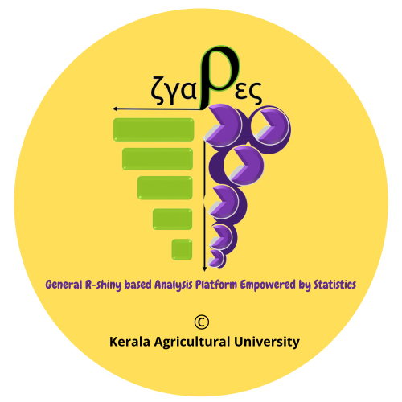

# Preface {-}

 **Note**: This book is published by XXXXXXXX. The online version of this book is free to read here, and licensed under the [Creative Commons Attribution-NonCommercial-ShareAlike 4.0 International License](http://creativecommons.org/licenses/by-nc-sa/4.0/). If you have any feedback, please feel free to [file an issue on GitHub](https://github.com/pratheesh3780/Design-and-Analysis-of-Experiments-in-Agriculture). Thank you!

This book is for all the researchers in Agriculture for improving quality of research 
